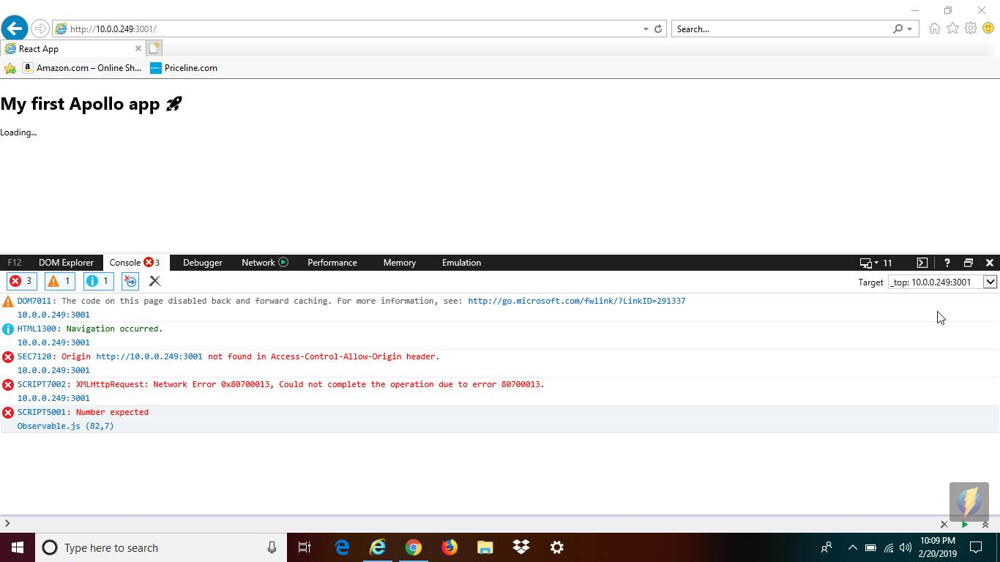
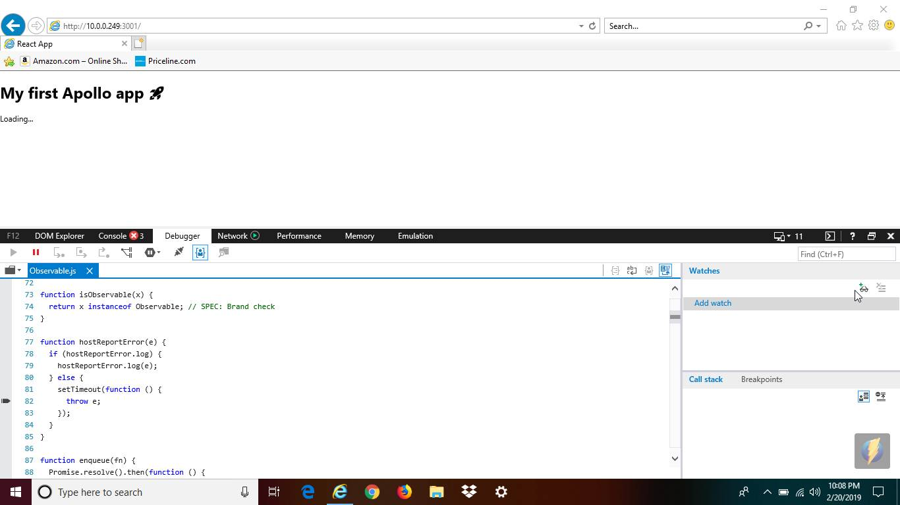

# apollo client app to demonstrate failure on IE11

Following the instructions in the Getting Started page for Apollo React Client, I built this app to demonstrate an error using it from Windows IE11.

I used polyfills from https://polyfill.io to give the necessary functions, including fetch, promise, Symbol, and fills for ES5, ES6, and ES7. (See public/index.html for the script call).

The app is running locally on my mac, and I'm pointing the windows IE11 browser to that mac.

## The following screenshot show the error and where it occurs:

## This screenshot shows the line in the debugger reporting the error:

## other browsers

All other browsers I tried on windows work fine, including Edge, Chrome, and Firefox.
